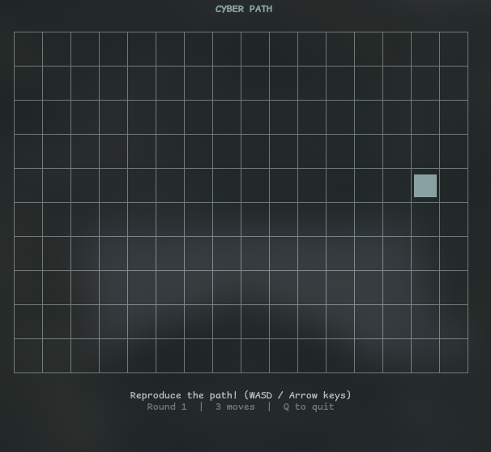
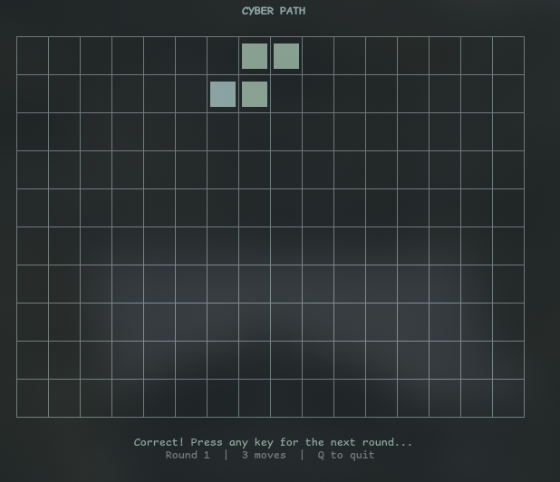
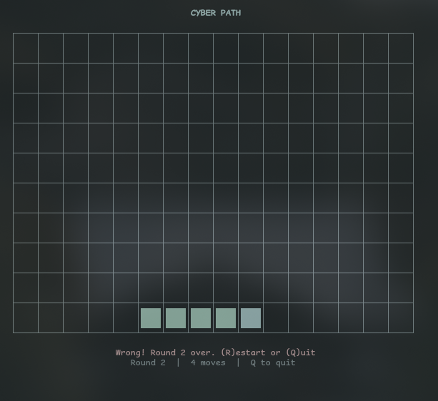

# Cyber Path – Terminal Game in Rust

A terminal-based memory game written in Rust.
The player is shown a path on a rectangular board. After a short preview phase, the path disappears and must be reproduced from memory.
Every round the path gets longer!

---

## Screenshots

<p align="center">
  
  <br><em>Input - phase: Waiting for an input!</em>
</p>

<p align="center">
  
  <br><em>Correct Path – Path was recreated correct!</em>
</p>

<p align="center">
  
  <br><em>Wrong Path - Path was recreated incorrectly!</em>
</p>
---

## Features

- Grid-based board rendered with Unicode box-drawing characters
- Configurable board size and difficulty
- Timed preview phase
- Keyboard-controlled movement
- Immediate validation of player input
- Clean terminal rendering using alternate screen buffer
- Sounds for bot movement, player movement, winning and losing

---

## Gameplay

1. A random path is generated on the board.
2. The path is displayed for a fixed preview duration.
3. The board is cleared.
4. The player must recreate the exact path using keyboard controls.
5. The game ends on success or first incorrect move.

---

## Controls

| Key              | Action     |
| ---------------- | ---------- |
| W / ↑            | Move up    |
| A / ←            | Move left  |
| S / ↓            | Move down  |
| D / →            | Move right |
| Q / Esc          | Quit game  |
| R (after defeat) | Restart    |

---

## Installation

### Prerequisites

- Rust (stable toolchain recommended)
  Install via: [https://rustup.rs](https://rustup.rs)

### Build

```bash
cargo build --release
```

### Run

```bash
cargo run
```

---

## Project Structure

```
src/
 ├── main.rs        # Entry point
 ├── input.rs       # Rendering logic
 ├── game.rs        # Game state and logic
 ├── models.rs        # Path generation
 └── ui.rs       # Keyboard handling
```

---

## Architecture Overview

- **Rendering Layer**: Responsible for terminal drawing and layout.
- **Game Logic Layer**: Manages state transitions (Preview → Input → Result).
- **Path Generator**: Produces valid, non-intersecting paths.
- **Input Handler**: Maps keyboard events to movement commands.

Separation of concerns ensures maintainability and testability.

---

## Configuration

Game parameters can be adjusted via constants or configuration module:

- Board width and height
- Path length
- Preview duration
- Difficulty scaling

---

## Dependencies

```toml
crossterm = "0.27"
rand = "0.8"
anyhow = "1.0"
```

---

## Error Handling

- Uses `anyhow::Result` for ergonomic error propagation.
- Terminal state is restored on exit.
- Graceful shutdown on panic recommended (e.g., `ctrlc` handler).

---

## Testing

Unit tests should cover:

- Path validity (bounds, no unintended intersections)
- Game state transitions
- Input validation logic

Run tests:

```bash
cargo test
```

---

## Future Improvements

- Score system
- Increasing difficulty levels
- Persistent high scores
- Color highlighting
- Sound feedback (optional terminal bell)

---

## License

MIT License.
